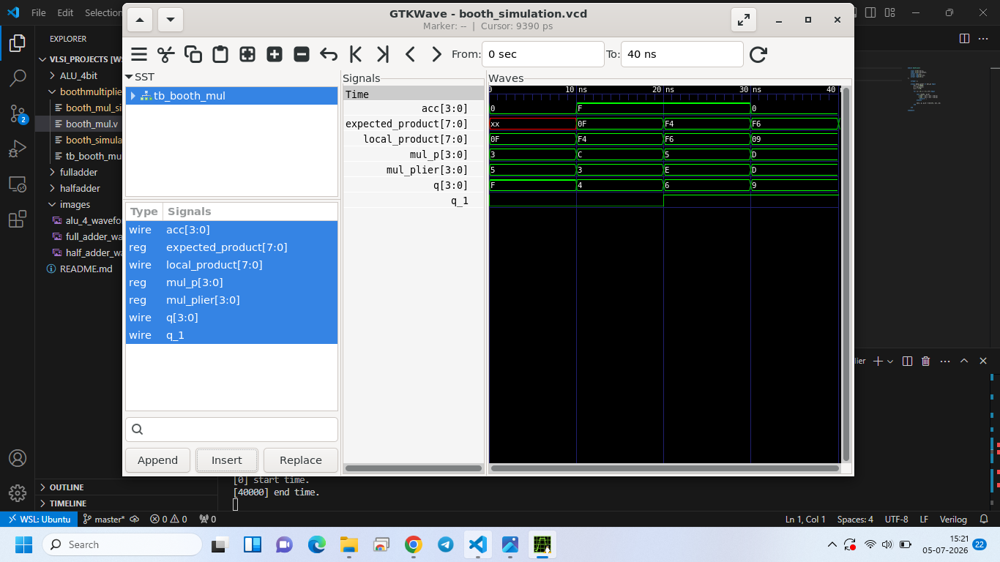

# Verilog-Digital-Design-Portfolio
RTL Design and Verification projects including ALUs, Multipliers, and FSMs

1. Half Adder (Design-1):
    I designed Hald Adder circuit in Verilog with Gate-level modeling and verified with testbench written to test all four test cases and analysed outcomes with GTK Waves.
    
    Verification of the fundamental building block: the Half Adder. The simulation shows the XOR logic for the sum and AND logic for the carry, ensuring zero-delay functional accuracy.

2. Full Adder (Design-2):
    I designed Full Adder circuit in Verilog with Gate-level modeling and veriied with testbench written to test all eight test cases and analysed outcomes with GTK Waves.
    
    Timing analysis of a Full Adder implemented using a gate-level modeling style. The waveform confirms that the sum and carry outputs correctly follow the truth table logic for all 8 input combinations (a, b, c).  

3. Arithmetic and Logic Unit(4-bit) (Design-3):
    I designed Arithmetic and Logic Unit(4-bit) circuit in Verilog with behavioral modeling and veriied with testbench running over 2,048+  test cases and analysed outcomes with GTK Waves. The Arithmetic and Logic Unit(4-bit) does 8 operations including arithmetic addition, arithmetic subtraction, multiplication, division, logical AND, logical OR, logical XOR and logical XNOR .
    
    This waveform demonstrates the functional verification of the 4-bit ALU supporting 8 operations. The inputs (a, b) and output (out) are displayed in Hexadecimal for clarity. Note the transitions between operation selection (sel); the brief 'xx' states represent uninitialized logic during the very first simulation step before the first clock/delay edge stabilizes the result.
    

4. Booth Multiplier (Design-4):
    I designed, radix-2 Booth Multiplier circuit in Verilog to perform efficient multiplication of two 4-bit signed (2's complement) integers, producing a valid 8-bit output (`{acc, q}`) with behavioral modeling and veriied with testbench and analysed outcomes with GTK Waves.
    
    
    
    Algorithmic State Evaluation: Uses a combinational looping structure to analyze consecutive bit-pairs (`{q[0], q_1}`) to dynamically determine whether to add or subtract the multiplicand (`mul_p`), effectively optimizing the hardware addition operations.
    
    Unified Shift Matrix: Implements a single-cycle combined concatenation block `{acc, q, q_1} = {acc[3], acc, q};` to perform a flawless Arithmetic Right Shift (ASR). This preserves the sign extension bit (`acc[3]`) continuously across all iterations without risking data corruption or bit-slippage.
    
    Fully Synthesizable: Written using standard blocking assignments within a deterministic loop structure, making it perfectly ready for synthesis on standard FPGA/ASIC standard cell libraries.
    
    
